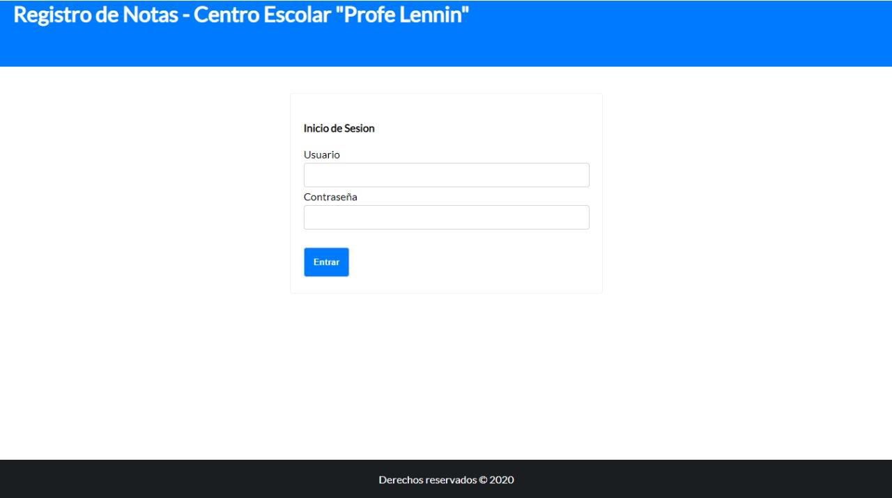
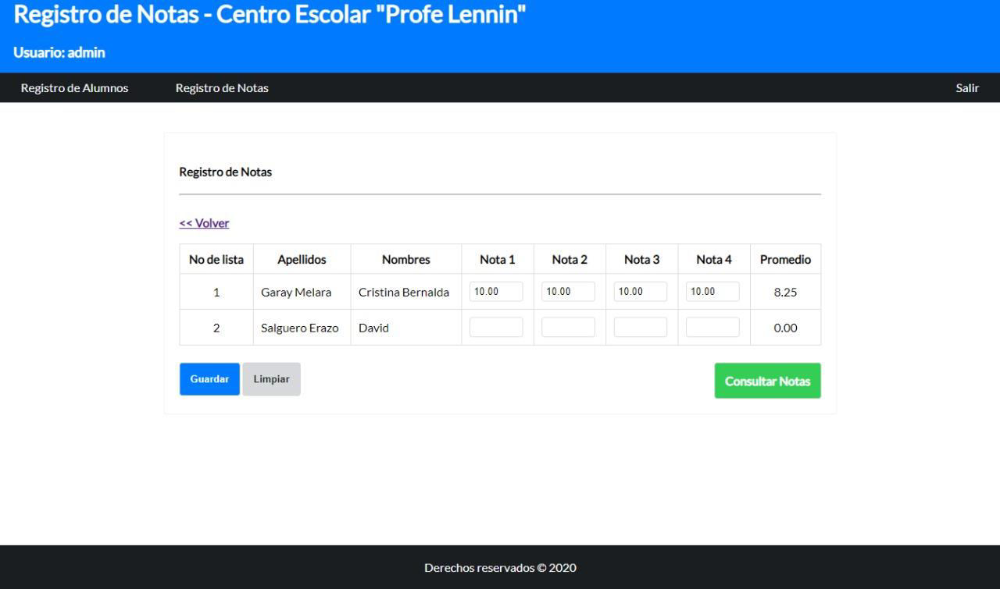

# Ejemplo básico de Registro Académico para centro escolar

El centro escolar “profe Lennin”, requiere un sistema de control de notas que le permita llevar de una forma ordenada las calificaciones de sus alumnos, los requisitos fundamentales son los siguientes:

<ul>
  <li>El registro de los alumnos debe de ser por salón y por grado.</li>
  <li>El sistema debe de contar al menos con una sección al momento de ser entregado.</li>
  <li>El sistema debe de ser Escalable de forma sencilla, en grados y secciones.</li>
  <li>El sistema debe de contar con campos para una sola materia al momento de ser entregado.</li>
  <li>El sistema debe de ser Escalable para poder agregar más materias por grado.</li>
</ul>
  
<strong>Database E-R Diagram</strong>

 
<strong>Login form</strong>

 
<strong>Register form</strong>

  
  
<strong>SUPPORT</strong>
  
